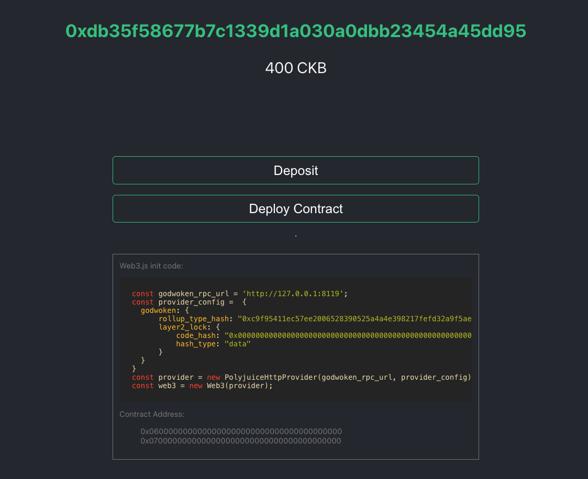

# Godwoken-Kicker

one line command to start a quick devnet godwoken-polyjuice chain for contract depolyment.

with web3 custom provider like [polyjuice-providers-http](https://github.com/RetricSu/polyjuice-providers-http), you can do simple debugging and testing for your dapp as well.

## How to run

```sh
git clone https://github.com/RetricSu/godwoken-kicker.git
cd godwoken-kicker 
```

when you run first time, do:

```sh
make init
```

then you can start godwoken and polyjuice:

```sh
make start
```

you can watch godwoken and polyjuice backend real-time activities by running:

```sh
make show-polyjuice
make show-godwoken
```

after everything started, check `http://localhost:6100/` to deploy contract.



## How to deploy contract

1. open `http://localhost:6100/`, connect with your metamask address
2. click `Deposit` button to fund some devnet ckb on your metamask address.
3. after deposit finished, 
    - click `Deploy Contract` button
    - select the contract compiled binary file from your computer
    - sign the message with metamask 
   
then the deployment will auto start.

after deployment successfully get done, you will find the contract address listing below.

with deployed contract address and the above web3.js-init-code sample, you are good to go.

## How to test dapp

read [doc here](docs/test-simple-dapp).


