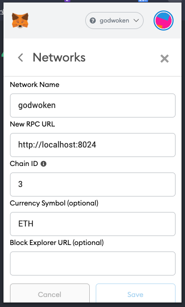

# Godwoken-Kicker

one line command to start a quick devnet godwoken-polyjuice chain for contract depolyment.

## How to run

```md
## quick-mode

use prebuild scripts and binary from docker images, one click to go
which means everything is set by default

## custom-mode

use manual build scripts and binary, for more custom needs
eg: you want to debug godwoken, web3 or even the godwoken-scripts
```

### 1. quick mode

make sure you have `docker` and `docker-compose` install on your machine.

```sh
    docker --version
    docker-compose --version
```

clone the code: 

```sh
git clone https://github.com/RetricSu/godwoken-kicker.git
cd godwoken-kicker 
```

when you run first time, do:

```sh
make init
```

then you can start godwoken-polyjuice chain by simply running:

```sh
make start
```

you can monitor godwoken and polyjuice backend real-time activities:

```sh
make sp # sp means show polyjuice activities
make sg # sg means show godwoken activities
```

after everything started, check `http://localhost:6100/` to deploy contract.


you will need to change your Metamask network setting like following:

```sh
    Network Name: Godwoken
    New RPC URL: http://localhost:8024
    Chain ID: 0x3
```



### 2. custom mode

make sure you have `docker` and `docker-compose` install on your machine.

```sh
    docker --version
    docker-compose --version
```

clone the code: 

```sh
git clone https://github.com/RetricSu/godwoken-kicker.git
cd godwoken-kicker 
```

#### custom submodule setting

gen submodule list:

```sh
make gen-submodule-env
```

then check out the generated-file in `/docker/.manual.build.list.env`:

```sh
####[mode]
MANUAL_BUILD_GODWOKEN=false
MANUAL_BUILD_WEB3=false
MANUAL_BUILD_SCRIPTS=false
MANUAL_BUILD_POLYJUICE=false

####[godwoken]
#info: tags/v0.2.0-rc3-0-g96cb75d, 96cb75d Sanitize deposit cells
GODWOKEN_URL=https://github.com/nervosnetwork/godwoken.git
GODWOKEN_BRANCH=master
GODWOKEN_COMMIT=96cb75d

####[godwoken-web3]
#info: heads/main-0-g0bb83b9, 0bb83b9 Merge pull request #1 from Flouse/docker
GODWOKEN_WEB3_URL=https://github.com/nervosnetwork/godwoken-web3.git
GODWOKEN_WEB3_BRANCH=main
GODWOKEN_WEB3_COMMIT=0bb83b9

####[godwoken-polyjuice]
#info: tags/v0.6.0-rc1-0-g548d76e, 548d76e Merge pull request #29 from TheWaWaR/update-godwoken-scripts
GODWOKEN_POLYJUICE_URL=https://github.com/nervosnetwork/godwoken-polyjuice.git
GODWOKEN_POLYJUICE_BRANCH=main
GODWOKEN_POLYJUICE_COMMIT=548d76e

####[godwoken-examples]
#info: heads/polyman-master-0-g200a17a, 200a17a Update server.json
GODWOKEN_EXAMPLES_URL=https://github.com/RetricSu/godwoken-examples.git
GODWOKEN_EXAMPLES_BRANCH=polyman-master
GODWOKEN_EXAMPLES_COMMIT=200a17a

####[godwoken-scripts]
#info: heads/master-0-gec77128, ec77128 Merge pull request #25 from nervosnetwork/fix-post-global-state-check
GODWOKEN_SCRIPTS_URL=https://github.com/nervosnetwork/godwoken-scripts.git
GODWOKEN_SCRIPTS_BRANCH=master
GODWOKEN_SCRIPTS_COMMIT=ec77128
```

change `MANUAL_BUILD_GODWOKEN` under `[mode]` section to `true` if you want to build godwoken binary (through submodule) on manual. 

same as `MANUAL_BUILD_WEB3`. the other two currently not supported yet.

you can also change the submodule info (like remote url/branch/commit) to fetch your own submodule if you want. 

just run the follwoing command after you edit the `/docker/.manual.build.list.env` file.

```sh
make update-submodule
``` 

and the submodules in kicker will be updated immediately.

#### custom scripts/generator/validator building

edit `godwoken-scripts` and `godwoken-polyjuice` submodules in `/docker/.manual.build.list.env` to better suit your needs.

then run:

```sh
make update-submodule
make rebuild-scripts
```

and you will have brand-new `scripts/generator/validator` ready to use under `/config` folder.

#### start godwoken-polyjuice chain

when you run first time, do:

```sh
make init
```

then you can start godwoken-polyjuice chain by simply running:

```sh
make start
```

you can monitor godwoken and polyjuice backend real-time activities:

```sh
make sp # sp means show polyjuice activities
make sg # sg means show godwoken activities
```

after everything started, check `http://localhost:6100/` to deploy contract.


you will need to change your Metamask network setting like following:

```sh
    Network Name: Godwoken
    New RPC URL: http://localhost:8024
    Chain ID: 0x3
```


## How to deploy contract

0. ***CHANGE YOUR METAMASK NETWORK to GODWOKEN!***
1. open `http://localhost:6100/`, connect with your metamask address
2. click `Deposit` button to fund some devnet ckb on your metamask address.
3. after deposit finished, 
    - click `Deploy Contract` button
    - select the contract compiled binary file from your computer
    - sign the message with metamask 
   
then the deployment will auto start.

after deployment successfully get done, you will find the contract address listing below.

## How to test dapp

~~read [doc here](docs/test-simple-dapp.md).~~ needs update.

## Some useful command

```sh
make stop # stop the godwoken-polyjuice chain and everything related. (but not remove data) 
```

```sh
make start # start the godwoken-polyjuice chain service.
```

```sh
make start-f # force start. the default command `make start` will not deploy a new godwoken chain if it exits, use start-f if you want to deploy a new chain.
```

```sh
make clean # this will clean the ckb chain data and every other layer1-related cache data(eg: ckb-indexer data/ckb-cli data/lumos cache data) as well
```

```sh
make down # equals `docker-compose down`, down all the service 
```

so if you want to have a fresh start, you can run:

```sh
make down
make clean
make start-f
```

